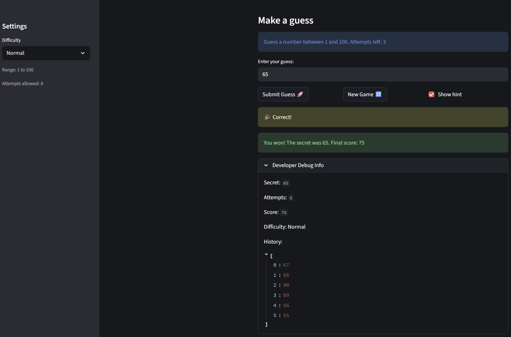

# 🎮 Game Glitch Investigator: The Impossible Guesser

## 🚨 The Situation

You asked an AI to build a simple "Number Guessing Game" using Streamlit.
It wrote the code, ran away, and now the game is unplayable. 

- You can't win.
- The hints lie to you.
- The secret number seems to have commitment issues.

## 🛠️ Setup

1. Install dependencies: `pip install -r requirements.txt`
2. Run the broken app: `python -m streamlit run app.py`

## 🕵️‍♂️ Your Mission

1. **Play the game.** Open the "Developer Debug Info" tab in the app to see the secret number. Try to win.
2. **Find the State Bug.** Why does the secret number change every time you click "Submit"? Ask ChatGPT: *"How do I keep a variable from resetting in Streamlit when I click a button?"*
3. **Fix the Logic.** The hints ("Higher/Lower") are wrong. Fix them.
4. **Refactor & Test.** - Move the logic into `logic_utils.py`.
   - Run `pytest` in your terminal.
   - Keep fixing until all tests pass!

## 📝 Document Your Experience

- [x] Describe the game's purpose.

  This is a number guessing game built with Streamlit. The player picks a difficulty, then tries to guess a secret number within a limited number of attempts. After each guess the game gives a hint telling you to go higher or lower. Your score starts at 100 and drops by 5 for each wrong guess, so the fewer guesses it takes the better your final score.

- [x] Detail which bugs you found.

  1. The hints were backwards. Guessing too high told the player to go higher instead of lower.
  2. After winning and clicking New Game, the game still showed "You already won" and would not let you play again.
  3. New Game did not clear the previous game's guess history or reset the score.
  4. Easy mode only gave 6 attempts while Normal gave 8, making Easy actually harder than Normal.
  5. The score bounced back and forth between guesses because a Too High guess on an even attempt number added points instead of subtracting them.
  6. Winning added a large bonus on top of the score, which did not fit the countdown scoring system.
  7. The guess history only updated after the second guess because the debug expander rendered before the submit handler ran.

- [x] Explain what fixes you applied.

  1. Swapped the hint messages in `check_guess` so Too High says "Go LOWER" and Too Low says "Go HIGHER".
  2. Added `st.session_state.status = "playing"` to the New Game handler so the game resets properly.
  3. Added `st.session_state.history = []` and `st.session_state.score = 100` to the New Game handler.
  4. Changed Easy mode attempts from 6 to 10 so Easy gives more attempts than Normal.
  5. Removed the even/odd attempt check in `update_score` so Too High always subtracts 5 points.
  6. Removed the win bonus from `update_score` so the final score is just whatever you had left when you guessed correctly.
  8. Moved the debug expander below the submit handler so it reflects the updated history immediately.
  9. Moved all four logic functions out of `app.py` and into `logic_utils.py` to separate game logic from the UI.

## 📸 Demo

- [x] 

## 🚀 Stretch Features

- [ ] [If you choose to complete Challenge 4, insert a screenshot of your Enhanced Game UI here]
